# Taxonomic Trees Of Life

The diagram below summarizes all creatures currently documented in the
`Creature Designs` folder. Species originating from Earth are grouped under
**Eukarya**, while Arathia's native life forms appear under
**Lithocellatae**.

```mermaid
graph TD
    Eukarya["Domain: Eukarya"]
    Lithocellatae["Domain: Lithocellatae"]

    Eukarya --> AnimaliaT["Kingdom: Animalia"]
    AnimaliaT --> ChordataT["Phylum: Chordata"]
    ChordataT --> MammaliaT["Class: Mammalia"]
    ChordataT --> AvesT["Class: Aves"]

    %% Eukarya Mammals
    MammaliaT --> ArtiodactylaT["Order: Artiodactyla"]
    ArtiodactylaT --> BovidaeT["Family: Bovidae"]
    BovidaeT --> Roosevellus
    Roosevellus --> BulwarkBison["Roosevellus scuticeros\\nBulwark Bison"]
    ArtiodactylaT --> CervidaeT["Family: Cervidae"]
    CervidaeT --> Velocivenator
    Velocivenator --> Velocifawn["Velocivenator cervus\\nVelocifawn"]

    MammaliaT --> Didelphimorphia["Order: Didelphimorphia"]
    Didelphimorphia --> Didelphidae
    Didelphidae --> Terrapossumus
    Terrapossumus --> Terrapossum["Terrapossumus armatus\\nTerrapossum"]

    MammaliaT --> Carnivora
    Carnivora --> Dracofelidae
    Dracofelidae --> Dracofelis
    Dracofelis --> Bloodmaw["Dracofelis sanguinem\\nBloodmaw"]

    MammaliaT --> Rodentia
    Rodentia --> Muridae
    Muridae --> Rathnakus
    Rathnakus --> Rathnak["Rathnakus glaciensis\\nRathnak"]

    %% Eukarya Birds
    AvesT --> Passeriformes
    Passeriformes --> Corvidae
    Corvidae --> Corvathus
    Corvathus --> Corvath["Corvathus sapiens\\nCorvath"]

    AvesT --> Galliformes
    Galliformes --> Manipteridae
    Manipteridae --> Manipterornis
    Manipterornis --> Quarriel["Manipterornis socialis\\nQuarriel"]

    AvesT --> Theropodiformes
    Theropodiformes --> Raptoridae
    Raptoridae --> Thornraptor
    Thornraptor --> Thornspike["Thornraptor sylvestris\\nThornspike Raptor"]
    Raptoridae --> Brambleurus
    Brambleurus --> Rubus["Brambleurus ferox\\nRubus"]

    %% Lithocellatae Kingdoms
    Lithocellatae --> LithoAnimalia["Kingdom: Lithocellata"]
    Lithocellatae --> Voltaplantae["Kingdom: Voltaplantae"]

    %% Lithocellata Animals
    LithoAnimalia --> Hexapodiformes["Phylum: Hexapodiformes"]
    Hexapodiformes --> Dracos
    Dracos --> Quadripes

    Quadripes --> Behiriformes
    Behiriformes --> Flashornidae
    Flashornidae --> Flashornus
    Flashornus --> Flashhorn["Flashornus minor\\nFlashhorn"]
    Flashornus --> Flashicorn["Flashornus major\\nFlashicorn"]

    Behiriformes --> Corrosauridae
    Corrosauridae --> Corrosaurus
    Corrosaurus --> Corroder["Corrosaurus venenum\\nCorroder"]

    Quadripes --> Goliathiformes
    Goliathiformes --> Terraglyphae
    Terraglyphae --> Sapidracon
    Sapidracon --> Arakrii["Sapidracon guardianis\\nArak'rii"]
    Terraglyphae --> Cinerepleura
    Cinerepleura --> ArmoredTerrath["Cinerepleura armatus\\nArmored Terrath"]
    Goliathiformes --> Tyranniglyphae
    Tyranniglyphae --> Domustyrannus
    Domustyrannus --> Maulcifer["Domustyrannus spoilator\\nMaulcifer"]

    Quadripes --> Verdiferae
    Verdiferae --> Verdifera
    Verdifera --> Frondgrazer["Verdifera triplex\\nFrondgrazer"]

    Hexapodiformes --> Decapodiformes
    Decapodiformes --> Thoracica
    Thoracica --> Elytraptera
    Elytraptera --> Scarabemimidae
    Scarabemimidae --> Necroceras
    Necroceras --> ScavengerBeetle["Necroceras vorax\\nScavenger Beetle"]

    %% Voltaplantae Plants
    Voltaplantae --> Florata
    Florata --> Mobiliflora
    Mobiliflora --> Leviflora
    Leviflora --> Photosyphidae
    Photosyphidae --> PhotosypherGenus["Genus: Photosypher"]
    PhotosypherGenus --> Photosypher["Photosypher luminae\\nPhotosypher"]
```

