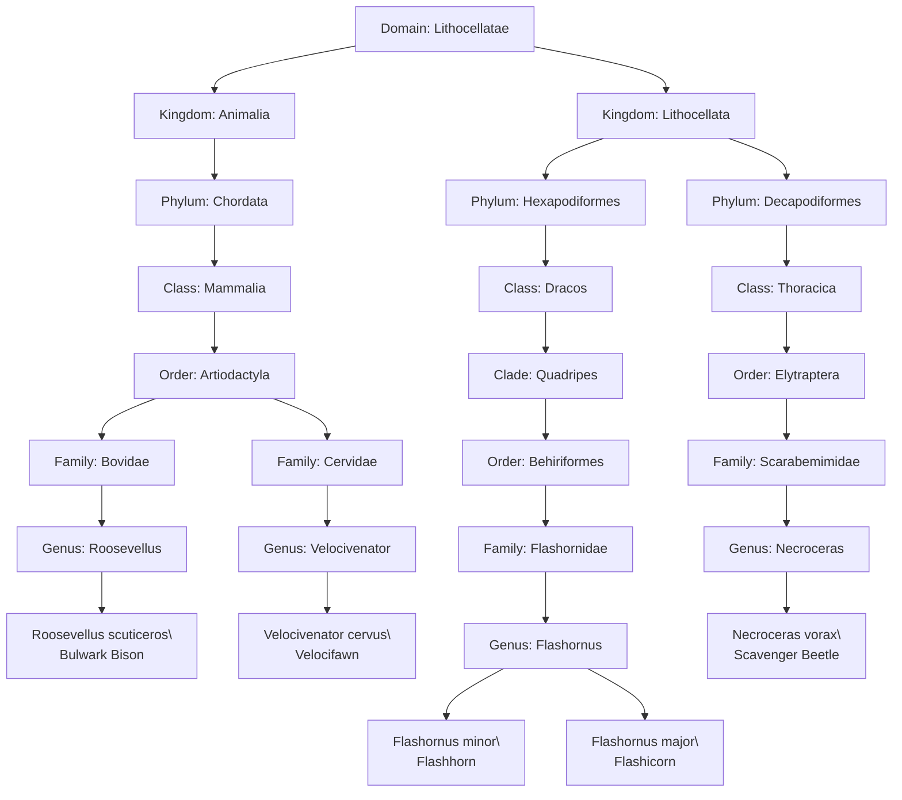

# Arathia Taxonomic Tree

This document replicates the wiki's mermaid diagram for Arathia's native species. Newly added species include the **Bulwark Bison**, **Velocifawn**, and the **Flashhorn/Flashicorn** pair.

